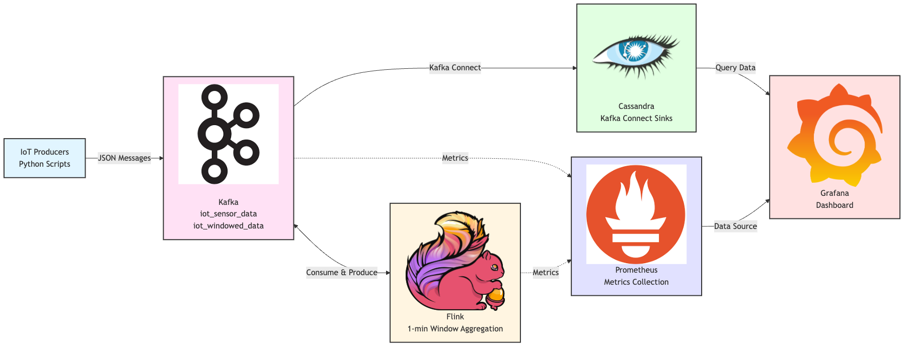

# IoT Streaming Data Pipeline (Kafka + Flink + Cassandra)

This project is a **real-time IoT data pipeline** that ingests, processes, and stores simulated sensor readings using modern streaming technologies.  
It's designed as a hands-on learning project to master **Apache Kafka**, **Apache Flink**, and **Apache Cassandra** — with room to expand into **Spark**, **Grafana**, or **Kafka Connect** later.

---

## Overview

### Architecture

```text
IoT Devices → Kafka → Flink → Cassandra → (optional) Grafana Dashboard
```

| Layer                | Tool                  | Purpose                                              |
| -------------------- | --------------------- | ---------------------------------------------------- |
| **Data Producers**   | Simulated IoT sensors | Emit JSON readings (temperature, humidity, etc.)     |
| **Messaging Layer**  | Apache Kafka          | Durable, scalable event streaming backbone           |
| **Stream Processor** | Apache Flink          | Real-time windowed aggregation and anomaly detection |
| **Data Sink**        | Apache Cassandra      | Time-series storage for sensor aggregates            |
| **(Optional)**       | Grafana               | Dashboard to visualize sensor trends                 |

### Data Flow

**Example raw event:**
```json
{
  "device_id": "device-01",
  "timestamp": "2025-11-05T12:00:00Z",
  "temperature": 27.5,
  "humidity": 40.2,
  "status": "OK"
}
```

**Processed record (after Flink aggregation):**
```json
{
  "device_id": "device-01",
  "window_start": "2025-11-05T12:00:00Z",
  "window_end": "2025-11-05T12:05:00Z",
  "avg_temp": 26.8
}
```

### Design Choices

**Why Cassandra over InfluxDB?**

While time-series databases like InfluxDB are optimized for telemetry and IoT use cases, this repository is designed as a **general-purpose streaming data pipeline foundation**. Cassandra was chosen because:

* **Broader applicability**: Works well for streaming data beyond just IoT/telemetry (e.g., financial transactions, user events, log streams)
* **Flexible data model**: Supports various data patterns, not just time-series
* **Streaming ecosystem integration**: Better integration with Kafka and Flink for general event streaming
* **Extensibility**: Easier to adapt for different streaming use cases beyond sensor data

This makes the repository a more versatile base for learning and building streaming architectures across multiple domains.

---

## Project Goals

* Learn Kafka fundamentals (topics, producers, consumers, offsets)
* Build a Flink job to process streaming data with windowing & state
* Persist processed data in Cassandra for long-term analytics
* Design a scalable, event-driven architecture with clear data flow
* Provide a base for future extensions (e.g. Spark ML, Kafka Connect)

---

## Repository Structure

```
.
├── deployments/              # Deployment configurations
│   ├── docker-compose/      # Local development setup
│   ├── cloud/               # Confluent Cloud + DataStax Astra DB
│   └── kubernetes/          # Self-hosted Kubernetes deployment
├── docs/                     # Documentation and learnings
└── README.md                 # This file
```

---

## Deployment Methods

This project supports three deployment approaches, each tailored to different use cases:

### 1. [Docker Compose](deployments/docker-compose/README.md) (Local Development)
**Best for:** Learning, local development, and testing

- Quick setup with `docker compose up`
- Self-contained local environment
- Perfect for learning the stack


### 2. [Cloud Deployment](deployments/cloud/README.md) (Managed Services)
**Best for:** Production cloud deployments with minimal infrastructure management

- Confluent Cloud (managed Kafka + Flink)
- DataStax Astra DB (serverless Cassandra)
- Fully managed services


### 3. [Kubernetes](deployments/kubernetes/README.md) (Self-Hosted)
**Best for:** Production deployments with full control

- Complete Kubernetes manifests
- Prometheus + Grafana monitoring
- Self-hosted OSS components


Each deployment method is self-contained with its own documentation and setup instructions.

---

## Quick Start

Choose your deployment method above, or start with Docker Compose for the simplest local setup:

```bash
git clone https://github.com/gwarren3210/iot-streaming-pipeline.git
cd iot-streaming-pipeline/deployments/docker-compose
```

See the [Docker Compose deployment guide](deployments/docker-compose/README.md) for detailed setup instructions.

---

## Learning Outcomes

By working through this project, you'll understand how to:

* Build a scalable, decoupled streaming architecture
* Handle real-time data with exactly-once semantics in Flink
* Integrate Kafka and Cassandra for low-latency analytics
* Design event-driven systems for real-world use cases (IoT, monitoring, fintech, etc.)

---

## Future Improvements

* [ ] Add **Spark Structured Streaming** for batch analytics
* [ ] Introduce **Schema Registry** for Avro/JSON consistency
* [ ] Add **Anomaly detection model** via Flink ML

---

## Documentation

* **[Migration Summary](docs/MIGRATION_SUMMARY.md)** - Project restructuring details
* **[Learnings](docs/learnings/)** - Configuration notes and migration walkthroughs

---

## License

Apache 2.0 License © 2025 Gavriel Warren

---

## Architecture Diagram


